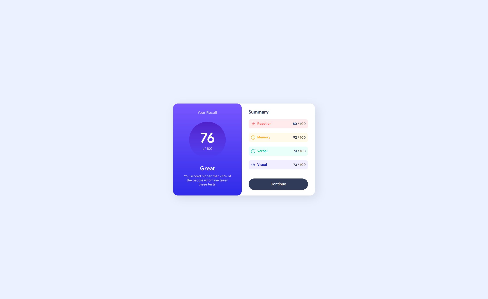
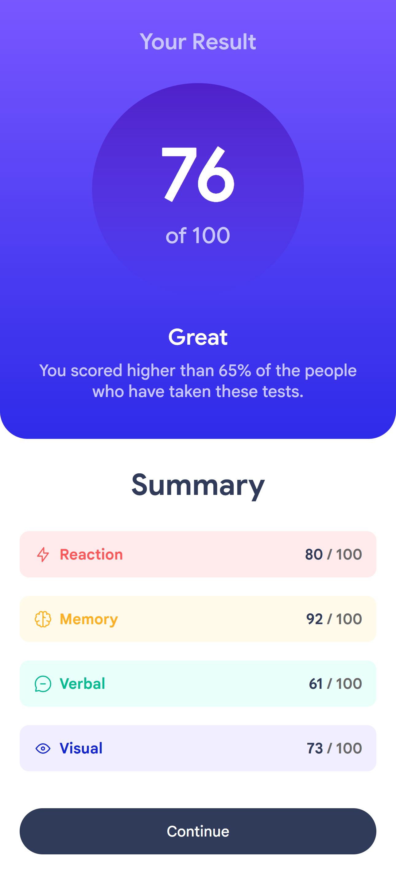

# Frontend Mentor - Results summary component solution

## Table of contents

- [Overview](#overview)
  - [The challenge](#the-challenge)
  - [Screenshot](#screenshot)
  - [Links](#links)
- [My process](#my-process)
  - [Built with](#built-with)
  - [What I learned](#what-i-learned)
  - [Useful resources](#useful-resources)
- [Author](#author)

## Overview

### The challenge

Users should be able to:

- View the optimal layout for the interface depending on their device's screen size
- See hover and focus states for all interactive elements on the page

### Screenshot

### Links

- [Solution URL](https://your-solution-url.com)
- [Live Site URL](https://ilypr.github.io/summary-component/)

## My process

### Built with

- Semantic HTML5 markup
- CSS (Flexbox, media queries, CSS variables)
- Desktop-first workflow

### What I learned

With this project, I improved my understanding of CSS variables (using :root) and got more confident with @media queries. It was also my first time building a layout that changes structure across breakpoints (desktop vs. mobile).

### Useful resources

- [W3Schools](https://www.w3schools.com/cssref/atrule_media.php) - this exact paragraph helped me with understanding and implementing the @media Rule.

## Author

- [GitHub](https://github.com/ilypr)
- [Frontend Mentor](https://www.frontendmentor.io/profile/ilypr)
